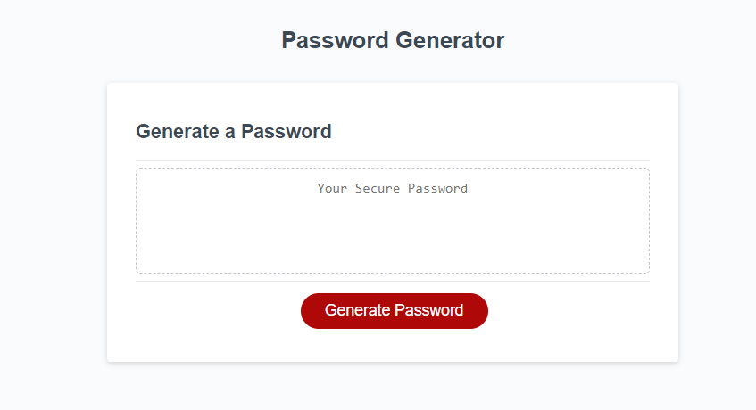

# Password Generator 
This simple JavaScript Password Generator is a lightweight tool that allows you to create secure and random passwords for your online accounts and applications. It's perfect for enhancing your online security by generating passwords that are difficult for hackers to guess.
## Features
### Customizable Parameters: 
* You can easily customize the generated password's length.
### Character Set Options:
* Choose from a variety of character sets, including uppercase letters, lowercase letters, numbers, and special symbols, to make your passwords even more diverse.

## Deployed Page

[Deployed GitPage](https://rrwx.github.io/JavaScript-Password-Generator/)

## Contributions
* Password Generator starter code: [Github repo](https://github.com/coding-boot-camp/friendly-parakeet)

